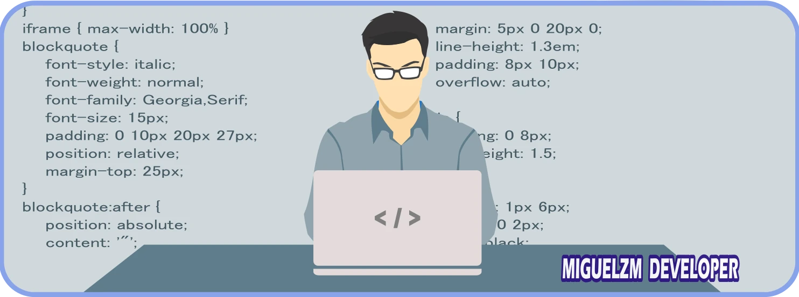

### Hi there 👋

 original image by:  [200degrees](https://pixabay.com/es/users/200degrees-2051452/?utm_source=link-attribution&utm_medium=referral&utm_campaign=image&utm_content=1653351)

 

    
    
    

<!--
**MiguelZM23/miguelzm23** is a ✨ _special_ ✨ repository because its `README.md` (this file) appears on your GitHub profile.

Here are some ideas to get you started:

- 🔭 I’m currently working on ...
- 🌱 I’m currently learning ...
- 👯 I’m looking to collaborate on ...
- 🤔 I’m looking for help with ...
- 💬 Ask me about ...
- 📫 How to reach me: ...
- 😄 Pronouns: ...
- ⚡ Fun fact: ...
-->
